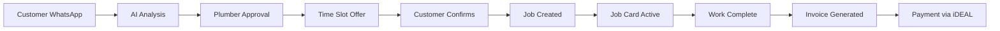
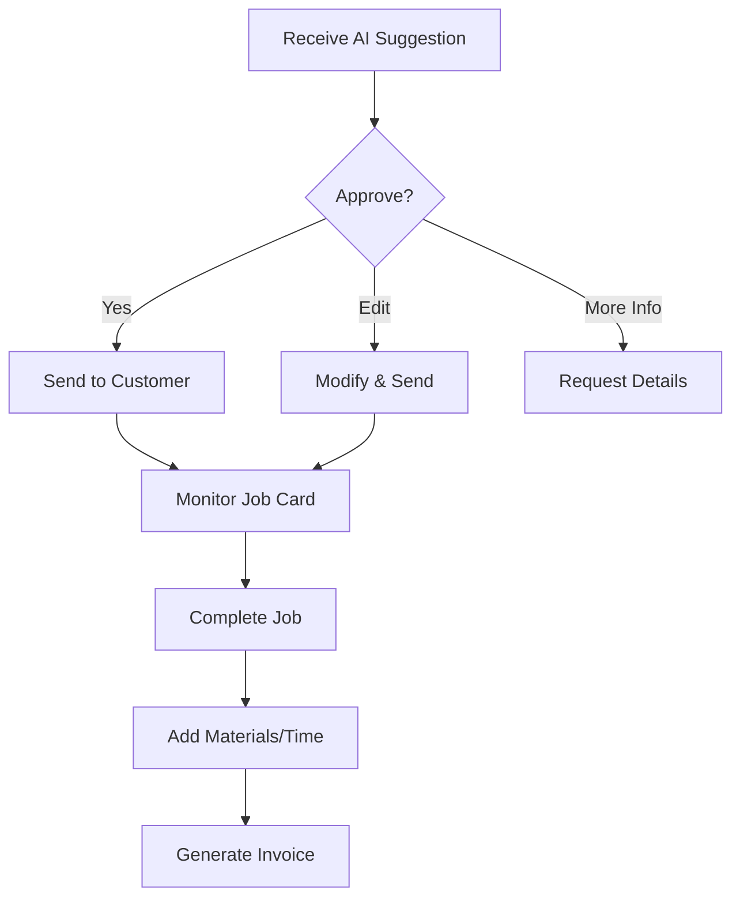

# PRP — WhatsApp AI Receptionist: Unified Master Document

**Version**: 2.0 (Consolidated)  
**Owner**: Plumbing Agent (Jordan)  
**Date**: 2025-01-09 (Europe/Amsterdam)  
**Target**: €2k MRR with 20 pilot plumbers in 4 weeks  
**Status**: Ready for Phase 1 Implementation  

---

## Executive Summary

### The Product
An AI-powered WhatsApp receptionist for Dutch emergency plumbers that eliminates 4-8 hours/week of admin work through intelligent automation of customer intake, scheduling, and invoicing.

### Core Innovation
- **Dual AI Interface**: WhatsApp Control Chat + Dashboard Chatbot (voice/text/screenshots)
- **Photo Intelligence**: AI analyzes plumbing issues from images → diagnosis + time estimate
- **Travel-Safe Scheduling**: Only offers physically possible appointment slots via Google Calendar
- **Job Cards**: Mobile-first command center for plumbers (offline-capable)
- **External Accounting**: Direct integration with Moneybird/e-Boekhouden/WeFact
- **Learning Loop**: Every plumber correction improves the AI

### Business Impact
- **Revenue**: €100-200/month per plumber subscription
- **Time Saved**: 4-8 hours/week per plumber on admin
- **Cash Flow**: 70%+ invoices paid within 24h via iDEAL
- **Conversion**: Higher booking rates through instant response

---

## Goals & Context

### Primary Goal
Ship a production-ready WhatsApp AI system that runs a plumber's entire day without forcing them into dashboards, while maintaining compliance with Dutch regulations and GDPR.

### Why Now
1. **Market Timing**: Dutch plumbers desperate for digital help post-COVID
2. **Tech Maturity**: WhatsApp Cloud API + AI capabilities finally production-ready
3. **Competition Gap**: No one else combines WhatsApp + AI + travel-aware scheduling
4. **Network Effects**: Each plumber adds training data, improving system for all

### Success Criteria
- [ ] 20 paying pilots achieving ≥€2k MRR within 4 weeks
- [ ] ≥80% AI triage accuracy on golden test set
- [ ] ≥70% invoices paid within 24h via iDEAL
- [ ] <10% of confirmed jobs have travel conflicts
- [ ] 99%+ WhatsApp message delivery success
- [ ] Zero data breaches or GDPR violations

---

## System Architecture

### Core Components

#### 1. WhatsApp Integration (Two-Number Model)
- **Number #1 (Business)**: Customer-facing for all inquiries
- **Number #2 (Control Chat)**: Private plumber ↔ AI conversation
- **Per Organization**: One number pair per plumbing company
- **Compliance**: 24-hour session window, template management

#### 2. AI Brain (Dual Interface)
- **WhatsApp Mode**: Plumber chats with AI in Control Chat
- **Dashboard Mode**: Web chatbot with voice/text/screenshot input
- **Capabilities**: Photo analysis, diagnosis, time estimation, quote generation
- **Learning**: Captures all corrections for continuous improvement

#### 3. Job Cards (Primary Interface)
- **Mobile-First**: Optimized for one-handed use in the field
- **Offline-Capable**: Full functionality with background sync
- **Features**: Timer, materials tracking, customer communication
- **Navigation**: Day/week views with swipe navigation

#### 4. Customer Portal (White-Label)
- **Branding**: Plumber's logo, colors, business name
- **Features**: View appointment, reschedule, emergency contact
- **Calendar**: "Add to Google Calendar" with .ics download
- **Professional**: Builds trust with clean, mobile-responsive design

#### 5. Scheduling Engine
- **Google Calendar**: Customer-facing source of truth
- **Schedule-X**: Internal week views and planning
- **Travel Validation**: Google Distance Matrix API for realistic slots
- **Buffer Policies**: Configurable risk margins for travel

#### 6. Accounting Integration
- **Providers**: Moneybird (primary), e-Boekhouden, WeFact
- **OAuth**: Secure token management with PKCE flow
- **Invoicing**: Direct creation in provider systems
- **Payments**: Mollie iDEAL integration with webhooks

---

## Data Flow

### Customer Journey


### Plumber Workflow


---

## Functional Requirements

### Phase 1 (MVP Core)

#### FR1: WhatsApp Foundation
- **Dual Numbers**: Business (#1) + Control Chat (#2) per organization
- **Webhook Processing**: HMAC verification, idempotent handling
- **Auto-Customer Creation**: New numbers create customer records
- **Session Management**: 24-hour window tracking for compliant messaging
- **Message Templates**: Basic set for common scenarios

#### FR2: AI Brain Core
- **Dual Interface**: WhatsApp Control Chat + Dashboard Chatbot
- **Input Types**: Text, photos, voice (speech-to-text), screenshots
- **Analysis Output**: Triage category, diagnosis hypotheses, time estimate
- **Plumber Control**: All suggestions require approval before sending
- **Learning Events**: Capture all edits for model improvement

#### FR3: Job Cards (Mobile Command Center)
- **Offline Mode**: Full functionality with sync when connected
- **Navigation**: Today view, week view, swipe between days
- **Time Tracking**: Running timer, estimated vs actual comparison
- **Communication**: One-tap WhatsApp, call, custom status templates
- **Materials**: Quick-add materials, running totals
- **Maps**: One-tap navigation to job location

#### FR4: Customer Portal
- **White-Label**: Plumber branding (logo, colors, name)
- **Job View**: Appointment details, quote, plumber info
- **Actions**: Reschedule, emergency contact, add to calendar
- **Status**: Real-time job progress updates
- **Mobile**: Responsive design for all devices

#### FR5: Scheduling System
- **Google Calendar**: Primary source of truth
- **Travel Validation**: Distance Matrix API for feasible slots
- **Buffer Policy**: Configurable margins for risk management
- **Sync**: Real-time between database and Google Calendar
- **Schedule-X**: Week overview with drag-and-drop editing

#### FR6: Accounting Integration
- **Moneybird**: Complete OAuth + invoice creation
- **Provider Support**: e-Boekhouden, WeFact connections
- **Invoice Generation**: From job completion with materials
- **Payment Links**: Mollie iDEAL integration
- **Status Tracking**: Payment updates via webhooks

#### FR7: Core Workflows
- **Intake → Diagnosis**: Customer message → AI analysis → plumber review
- **Scheduling**: Travel-safe slot generation → customer confirmation
- **Job Execution**: Job Card tracking → completion → materials entry
- **Invoicing**: Draft generation → review → send with payment link
- **Payment**: iDEAL processing → status updates → reminders

### Phase 2 (Future Enhancements)

#### FR8: Advanced AI
- **Full-Auto Mode**: AI can schedule without approval
- **Materials Intelligence**: Suggest parts from photos
- **Voice Notes**: Accept audio → transcript → invoice
- **Photo Annotation**: Mark up images for clarity

#### FR9: Live Features
- **GPS Tracking**: Real-time plumber location
- **ETA Updates**: "On the way" with arrival time
- **Traffic Integration**: Delay suggestions based on conditions
- **Customer Notifications**: Proactive status updates

#### FR10: Business Features
- **Signature Capture**: Digital signature on completion
- **Template Builder**: Custom WhatsApp message templates
- **Team Management**: Multi-plumber coordination
- **Advanced Rescheduling**: Complex travel recalculation
- **Multi-Day Jobs**: Projects spanning multiple days

---

## Non-Functional Requirements

### Security & Privacy
- **NFR1**: Supabase RLS for complete multi-tenant isolation
- **NFR2**: JWT-based authentication for all API calls
- **NFR3**: HMAC verification for all webhooks
- **NFR4**: OAuth2 PKCE flow for provider integrations
- **NFR5**: Encrypted storage for sensitive credentials
- **NFR6**: 24-hour token expiry for Job Card access

### GDPR Compliance
- **NFR7**: Explicit consent capture on first contact
- **NFR8**: Data retention: 90 days media, 180 days text
- **NFR9**: Right to deletion with cascading purge
- **NFR10**: Data portability via export API
- **NFR11**: Audit logs for all data access
- **NFR12**: PII redaction in logs and analytics

### Performance
- **NFR13**: P95 AI analysis < 2.5 seconds
- **NFR14**: P95 webhook processing < 2 seconds
- **NFR15**: Job Card load time < 1s on 3G
- **NFR16**: Offline sync < 5s when reconnected
- **NFR17**: Calendar sync latency < 500ms

### Reliability
- **NFR18**: 99.9% uptime for critical paths
- **NFR19**: Message delivery retry with exponential backoff
- **NFR20**: Graceful degradation on provider outages
- **NFR21**: Circuit breakers for external APIs
- **NFR22**: Idempotent operations for all mutations

### Dutch Market Requirements
- **NFR23**: Dutch-first UI with English fallback
- **NFR24**: nl-NL locale for dates/times/currency
- **NFR25**: BTW/VAT compliance (21%, 9%, 0%)
- **NFR26**: KVK number validation
- **NFR27**: Dutch postcode format (NNNNAA)
- **NFR28**: iDEAL as primary payment method

---

## Technical Implementation

### Stack Requirements
```yaml
Core:
  - Next.js 15.5.2 (App Router)
  - React 19.1.1
  - TypeScript 5.9.2
  - tRPC v11.5.0
  - Supabase (PostgreSQL + RLS)
  - Clerk v6.31.6 (Authentication)

UI:
  - shadcn/ui components
  - Tailwind CSS v4
  - next-intl v4.3.5 (i18n)

Calendar:
  - Google Calendar API
  - Schedule-X v3.0.0
  - Temporal (date handling)

AI & Messaging:
  - WhatsApp Cloud API
  - AI SDK v5 (Vercel)
  - Google Distance Matrix API

Accounting:
  - Moneybird API
  - e-Boekhouden API
  - WeFact API
  - Mollie SDK (payments)

Quality:
  - Biome v2.2.2 (formatter)
  - ESLint v9 (linting)
  - Playwright MCP (testing)
  - Zod v4.1.4 (validation)
```

### Database Schema

```typescript
// Organizations (multi-tenant root)
export const organizations = pgTable("organizations", {
  id: uuid("id").primaryKey().defaultRandom(),
  name: varchar("name", { length: 255 }).notNull(),
  whatsappBusinessNumber: varchar("whatsapp_business", { length: 20 }),
  whatsappControlNumber: varchar("whatsapp_control", { length: 20 }),
  googleCalendarId: varchar("google_calendar_id", { length: 255 }),
  settings: jsonb("settings").$type<OrgSettings>(),
  createdAt: timestamp("created_at").notNull().defaultNow(),
});

// AI Analysis Runs
export const aiRuns = pgTable("ai_runs", {
  id: uuid("id").primaryKey().defaultRandom(),
  orgId: uuid("org_id").notNull().references(() => organizations.id),
  customerId: uuid("customer_id").references(() => customers.id),
  jobId: uuid("job_id").references(() => jobs.id),
  input: jsonb("input").notNull(),
  output: jsonb("output").notNull(),
  model: varchar("model", { length: 50 }).notNull(),
  latencyMs: integer("latency_ms").notNull(),
  costCents: integer("cost_cents"),
  createdAt: timestamp("created_at").notNull().defaultNow(),
});

// Learning Events (for AI improvement)
export const aiLearningEvents = pgTable("ai_learning_events", {
  id: uuid("id").primaryKey().defaultRandom(),
  orgId: uuid("org_id").notNull().references(() => organizations.id),
  aiRunId: uuid("ai_run_id").references(() => aiRuns.id),
  eventType: varchar("event_type", { length: 50 }).notNull(), // TIME_EDIT, DIAGNOSIS_EDIT
  before: jsonb("before").notNull(),
  after: jsonb("after").notNull(),
  plumberId: uuid("plumber_id").references(() => employees.id),
  createdAt: timestamp("created_at").notNull().defaultNow(),
});

// WhatsApp Conversations
export const waConversations = pgTable("wa_conversations", {
  id: uuid("id").primaryKey().defaultRandom(),
  orgId: uuid("org_id").notNull().references(() => organizations.id),
  customerId: uuid("customer_id").references(() => customers.id),
  waContactId: varchar("wa_contact_id", { length: 50 }).notNull(),
  phoneNumber: varchar("phone_number", { length: 20 }).notNull(),
  lastMessageAt: timestamp("last_message_at").notNull(),
  sessionExpiresAt: timestamp("session_expires_at"),
  status: varchar("status", { length: 20 }).notNull(), // active, expired, closed
  metadata: jsonb("metadata"),
  createdAt: timestamp("created_at").notNull().defaultNow(),
});

// Job Cards (extends existing jobs table)
export const jobCards = pgTable("job_cards", {
  id: uuid("id").primaryKey().defaultRandom(),
  jobId: uuid("job_id").notNull().references(() => jobs.id),
  accessToken: varchar("access_token", { length: 64 }).unique(),
  expiresAt: timestamp("expires_at").notNull(),
  timerStartedAt: timestamp("timer_started_at"),
  actualMinutes: integer("actual_minutes"),
  materialsAdded: jsonb("materials_added").$type<Material[]>(),
  statusTemplates: jsonb("status_templates").$type<StatusTemplate[]>(),
  offlineData: jsonb("offline_data"),
  lastSyncedAt: timestamp("last_synced_at"),
});

// Accounting Connections
export const accountingConnections = pgTable("accounting_connections", {
  id: uuid("id").primaryKey().defaultRandom(),
  orgId: uuid("org_id").notNull().references(() => organizations.id),
  provider: varchar("provider", { length: 20 }).notNull(), // moneybird, eboekhouden, wefact
  accessToken: text("access_token").notNull(),
  refreshToken: text("refresh_token"),
  externalOrgId: varchar("external_org_id", { length: 100 }),
  settings: jsonb("settings"),
  healthStatus: varchar("health_status", { length: 20 }), // ok, token_invalid, admin_missing
  lastHealthCheck: timestamp("last_health_check"),
  createdAt: timestamp("created_at").notNull().defaultNow(),
});
```

### API Contracts (tRPC)

```typescript
// AI Brain Router
export const brainRouter = createTRPCRouter({
  analyzeIssue: protectedProcedure
    .input(z.object({
      channel: z.enum(["whatsapp", "dashboard", "screenshot"]),
      text: z.string().optional(),
      attachments: z.array(AttachmentSchema).optional(),
      voiceUrl: z.string().optional(),
    }))
    .mutation(async ({ input, ctx }) => {
      // Returns: triage, diagnosis, timeEstimate, quoteDraft
    }),

  approveAndSend: protectedProcedure
    .input(z.object({
      aiRunId: z.string().uuid(),
      edits: z.any().optional(),
      sendVia: z.enum(["whatsapp", "email", "sms"]),
    }))
    .mutation(async ({ input, ctx }) => {
      // Captures learning event, sends to customer
    }),

  generateInvoice: protectedProcedure
    .input(z.object({
      jobId: z.string().uuid(),
      timeMinutes: z.number(),
      materials: z.array(MaterialSchema),
      notes: z.string().optional(),
    }))
    .mutation(async ({ input, ctx }) => {
      // Creates invoice in connected provider
    }),
});

// WhatsApp Router
export const whatsappRouter = createTRPCRouter({
  handleWebhook: publicProcedure
    .input(z.any())
    .mutation(async ({ input }) => {
      // HMAC verify, process, route to AI
    }),

  sendMessage: protectedProcedure
    .input(z.object({
      to: z.string(),
      text: z.string().max(1000),
      useTemplate: z.boolean().optional(),
    }))
    .mutation(async ({ input, ctx }) => {
      // Session check, send via appropriate method
    }),
});

// Schedule Router
export const scheduleRouter = createTRPCRouter({
  proposeSlots: protectedProcedure
    .input(z.object({
      customerId: z.string().uuid(),
      durationMinutes: z.number(),
      urgency: z.enum(["emergency", "urgent", "normal"]),
    }))
    .mutation(async ({ input, ctx }) => {
      // Generate travel-safe slots
    }),

  confirmSlot: protectedProcedure
    .input(z.object({
      slotId: z.string(),
      customerId: z.string().uuid(),
    }))
    .mutation(async ({ input, ctx }) => {
      // Create job, update calendars
    }),
});

// Job Card Router
export const jobCardRouter = createTRPCRouter({
  getToday: protectedProcedure
    .query(async ({ ctx }) => {
      // Return today's jobs with card data
    }),

  updateStatus: protectedProcedure
    .input(z.object({
      jobId: z.string().uuid(),
      status: JobStatusSchema,
      notifyCustomer: z.boolean(),
    }))
    .mutation(async ({ input, ctx }) => {
      // Update status, optionally notify
    }),

  syncOfflineData: protectedProcedure
    .input(z.object({
      jobId: z.string().uuid(),
      offlineChanges: z.any(),
    }))
    .mutation(async ({ input, ctx }) => {
      // Merge offline changes
    }),
});
```

---

## Risk Mitigation

### Technical Risks
| Risk | Mitigation |
|------|------------|
| WhatsApp API changes | Abstract messaging layer, maintain fallback SMS |
| AI hallucinations | Require plumber approval, confidence thresholds |
| Calendar sync failures | Queue + retry, manual refresh option |
| Offline conflicts | Last-write-wins with audit trail |
| Provider API limits | Rate limiting, caching, circuit breakers |

### Business Risks
| Risk | Mitigation |
|------|------------|
| Low plumber adoption | Free pilot period, hands-on onboarding |
| Customer privacy concerns | Clear consent, GDPR compliance visible |
| Invoice disputes | Complete audit trail, supervisor review option |
| Competitor copying | Fast iteration, network effects moat |

### Compliance Risks
| Risk | Mitigation |
|------|------------|
| GDPR violations | Privacy by design, regular audits |
| WhatsApp policy violation | Follow Meta guidelines, template approval |
| Dutch tax issues | Work with Dutch accountant, proper BTW handling |

---

## Success Metrics

### Phase 1 KPIs (First 4 Weeks)
- **Adoption**: 20 active plumbers
- **Revenue**: €2,000 MRR
- **Usage**: 50+ jobs/week processed
- **Accuracy**: 80%+ AI triage correctness
- **Payment**: 70%+ invoices paid in 24h
- **Satisfaction**: NPS > 50

### Long-term Goals (6 Months)
- **Scale**: 500 plumbers
- **Revenue**: €50,000 MRR
- **Market**: Expand beyond Amsterdam
- **Features**: Full Phase 2 deployment
- **Moat**: 10,000+ learning events/month

---

## Implementation Priority

### Critical Path (Must Have for Launch)
1. WhatsApp webhook infrastructure
2. Basic AI analysis (text + photo)
3. Job Card mobile interface
4. Google Calendar integration
5. Moneybird invoice creation
6. Mollie payment processing

### Quick Wins (Easy + High Value)
- One-tap navigation from Job Card
- Custom status templates
- Auto-customer creation
- WhatsApp message buttons
- Calendar .ics downloads

### Defer to Phase 2
- Live GPS tracking
- Voice note transcription
- Signature capture
- Complex rescheduling
- Multi-day job support

---

## Definition of Done

### Phase 1 Complete When:
- [ ] Two-number WhatsApp system operational
- [ ] AI analyzes photos with 80%+ accuracy
- [ ] Job Cards work offline with sync
- [ ] Google Calendar shows all appointments
- [ ] Invoices created in Moneybird with payment links
- [ ] 5 pilot plumbers using system daily
- [ ] GDPR compliance documented and tested
- [ ] All critical paths have error handling
- [ ] Monitoring and alerts configured
- [ ] Rollback procedures documented

---

## Appendices

### A. WhatsApp Template Examples
```yaml
welcome_nl:
  text: "Welkom bij {{business_name}}! Stuur ons een foto van uw probleem en we helpen u direct."

slot_confirmation_nl:
  text: "Afspraak bevestigd voor {{date}} om {{time}}. U ontvangt een herinnering 1 dag van tevoren."

running_late_nl:
  text: "Onze monteur loopt ongeveer {{minutes}} minuten uit. Onze excuses voor het ongemak."
```

### B. Travel Buffer Policy
```typescript
const bufferPolicy = {
  riskLevels: {
    low: { percentBuffer: 1.1, minCityMinutes: 5, minRuralMinutes: 10 },
    normal: { percentBuffer: 1.2, minCityMinutes: 10, minRuralMinutes: 15 },
    high: { percentBuffer: 1.3, minCityMinutes: 15, minRuralMinutes: 20 }
  },
  rushHourMultiplier: 1.5,
  weatherMultiplier: 1.2
};
```

### C. Learning Event Structure
```typescript
interface LearningEvent {
  type: "TIME_ESTIMATE" | "DIAGNOSIS" | "MATERIALS";
  original: any;
  corrected: any;
  context: {
    photos?: string[];
    text?: string;
    outcome?: "accurate" | "overestimate" | "underestimate";
  };
}
```

---

*This document consolidates and supersedes: whatsapp_ai_receptionist_prp.md, Whatsapp_mvp_lite.md, mvp_lite_epic.md, and phase4_ai_brain_prp.md*